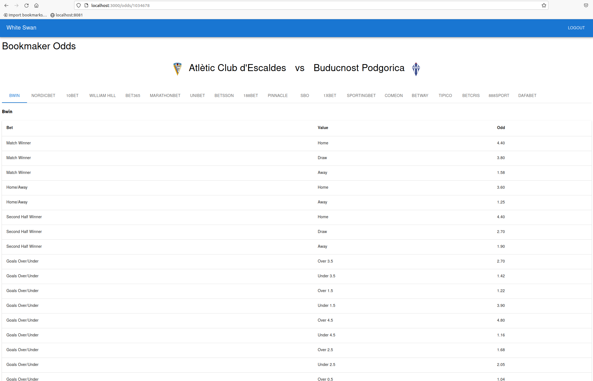

## Run
- Back end has a static build of the site
- (option 1) ```npm run server``` on the back end and go to ```http://localhost:4000/```
- If that doesn't work, leave the back end running and, (option 2) front end can also be run from react dev server. The api is hardcoded. ```npm run start``` on the front end to run and go to ```http://localhost:3000/```
- (option 3) I have the sample running [here](http://100.26.186.255:4000/)

## Setup
- Both front end and back end project are in the same repo.
- Typescript and Express on the back end, Typescript, React and MaterialUI on the front end.
- ```npm install``` in both for dependencies. ```npm run server``` on the back end and ```npm run start``` on the front end to run. Both running in dev mode, no prod build.

## Credentials
- server uses .env file in the project root for credentials. Mine looks like   
```
XRapidAPIKey="67v<my-api-key>9u"
XRapidAPIHost="api-football-v1.p.rapidapi.com"
USERNAME="testuser"
PASSWORD="testpass"
JWTSECRET="myJwtSecret123ABC"
```

## Login
- Uses JWT for authentication.
- Single user with credentials stored in .env file.
- User can access all pages and endpoints once they are logged in.
- Unauthorized access redirects back to login screen.


## Fixtures
- Single api call gets the next 50 fixtures.
- Search string does local search within home or away team name.


## Odds
- Gets odds for the particular fixture if available.
- Tab view for each bookmaker


